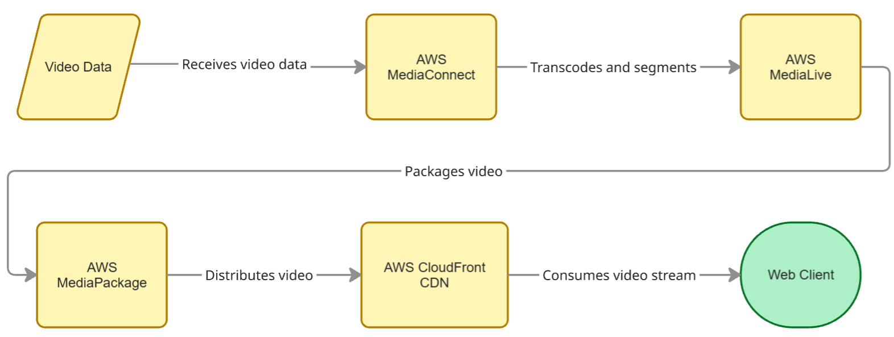

# Live Video Streaming Platform

AWS-based live video streaming platform with SRT ingest, ABR transcoding, HLS packaging, and CDN distribution — fully provisioned with Terraform.

## Architecture



| Component | AWS Service | Purpose |
|-----------|-------------|---------|
| Ingest | Elemental MediaConnect | SRT listener — receives live stream from the internet |
| Transcoding | Elemental MediaLive | ABR encoding (1080p / 720p / 480p) with H.264 + AAC |
| Packaging | Elemental MediaPackage v2 | HLS manifest & MPEG-TS segment generation |
| Distribution | Amazon CloudFront | Low-latency edge CDN delivery |
| Player | Static Website | hls.js-based HTML5 video player |

## Signal Ingest (SRT)

| Setting | Value |
|---------|-------|
| Protocol | SRT (Secure Reliable Transport) |
| Mode | Listener — MediaConnect opens a port and waits for the sender |
| Port | 5000 (configurable via `srt_port`) |
| Latency | SRT default 120 ms — suitable for contribution-quality feeds |

**Source options:** OBS Studio

## Transcoding — ABR Ladder

| Rendition | Resolution | Video Bitrate | Codec | Profile | GOP | Audio |
|-----------|-----------|---------------|-------|---------|-----|-------|
| 1080p | 1920×1080 | 5 Mbps | H.264 | High | 2 s | AAC 128 kbps |
| 720p | 1280×720 | 3 Mbps | H.264 | Main | 2 s | AAC 128 kbps |
| 480p | 854×480 | 1.5 Mbps | H.264 | Main | 2 s | AAC 128 kbps |

- **Frame rate:** 30 fps
- **GOP structure:** Closed GOP, 2-second duration (60 frames)
- **Segment duration:** 6 seconds

## Packaging (HLS)

| Setting | Value |
|---------|-------|
| Protocol | HLS (HTTP Live Streaming) |
| Container | MPEG-TS |
| Segment duration | 6 seconds |
| Manifest | Multi-variant playlist with per-rendition child manifests |

## CDN Distribution (CloudFront)

| Setting | Value |
|---------|-------|
| Cache TTL | min 0 s · default 5 s · max 30 s |
| Protocol | HTTPS (HTTP → HTTPS redirect) |

## Web Player

Minimal HTML5 page using [hls.js](https://github.com/video-dev/hls.js/) for adaptive HLS playback.


## Configuration

| Variable | Default | Description |
|----------|---------|-------------|
| `aws_region` | `us-east-1` | AWS deployment region |
| `project_name` | `live-stream` | Resource naming prefix |
| `environment` | `dev` | Environment tag |
| `srt_port` | `5000` | SRT listener port |
| `srt_source_cidr` | `0.0.0.0/0` | Allowed SRT sender CIDR |

Override defaults with a `terraform.tfvars` file or `-var` flags:

```bash
terraform -chdir=infrastructure apply -var="srt_port=6000"
```
